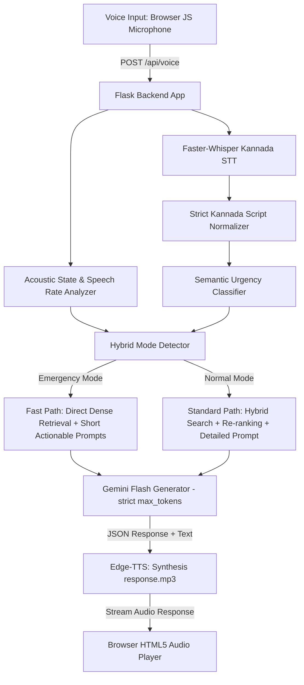

# Kannada Disaster Management AI: Research-Worthy RAG Upgrades

> [!NOTE]
> **User Clarification & Approval:** The user explicitly requested to completely replace the original Streamlit implementation with a custom **Flask backend** and **Vanilla HTML/CSS/JS frontend** for optimal styling, sub-second latency, and native microphone support. This has been fully approved and is currently being executed under SPEC-04.

Our goal is to build a system that is academically publication-worthy and practically viable for government demonstration.

---

## Technical Findings & Added Constraints

1. **Streamlit vs. Flask + Vanilla Frontend:**
   Streamlit is rigid and introduces high latency when managing complex audio states, dynamic JS recording, and custom CSS. 
   Migrating to a **Flask backend** with a **Vanilla HTML/CSS/JS frontend** provides:
   - **Total Styling Control:** Custom HSL color schemes, deep charcoal dark modes, glassmorphism, responsive grids, and clean visual layouts.
   - **Browser-Native Audio Recording:** Using the HTML5 MediaRecorder API to record audio in the browser and send lightweight WAV/WebM blobs via a POST request to Flask.
   - **Sub-Second Latency:** Eliminates Streamlit's page-reloading behavior. Communication happens via fast `/api/chat` and `/api/voice` AJAX/Fetch endpoints.

2. **Emergency vs. Normal Mode Detection:**
   A voice query will be classified into either **Emergency** or **Normal** mode using a hybrid **Acoustic & Semantic Panic Classifier**:
   - **Acoustic Check:** Analyze audio features (e.g., signal amplitude, energy variance, or speaking speed) from the recorded voice.
   - **Semantic/Lexical Check:** Fast scan of Kannada transcriptions for high-urgency keywords (e.g., *"ಕಾಪಾಡಿ"* / Help, *"ತುರ್ತು"* / Emergency, *"ಅಪಾಯ"* / Danger, *"ಬೆಂಕಿ"* / Fire).
   - **Behavioral Splitting:**
     * **Emergency Mode:** Ultra-low latency, direct, safety-critical 2-3 points response (maximum accuracy, zero conversational filler).
     * **Normal Mode:** 5-point safety guidelines, general disaster awareness, and interactive dashboard exploration.

3. **Strict Kannada Language Enforcement:**
   To align with local government requirements, the chatbot will operate strictly in the Kannada script. Any English or code-mixed ("Kanglish") inputs will be converted at the absolute boundary, ensuring the core RAG, vector database, and prompt generation occur strictly in clean Kannada.

4. **Spec-Driven Development (Context Retention):**
   To maintain precise context and documentation, we will implement a strict **Spec-Driven Development** flow. We will create a `docs/specs/` directory in your workspace and document each specification prior to and during implementation:
   ```
   docs/specs/
   ├── SPEC-00_Overview.md
   ├── SPEC-01_VectorDB_Multilingual.md
   ├── SPEC-02_Emergency_Normal_Classifier.md
   ├── SPEC-03_HybridSearch_ReRanking.md
   └── SPEC-04_Premium_Dashboard_UI.md
   ```
   Each spec document will explicitly record:
   - **Features Implemented**
   - **Implementation Architecture**
   - **Modified & New Files**
   - **Latency & Verification Benchmarks**

---

## Proposed Spec-Driven Roadmap



### SPEC-01: Vector DB Rectification & Multilingual Indic Embeddings
* **Dataset Bug Fix:** Map keys in `kannada_disaster_dataset.jsonl` programmatically to construct high-quality, retrieval-ready Kannada question-answer pairs:
  * *Question:* `"{disaster_type} ಸಮಯದಲ್ಲಿ ಏನು {ಮಾಡಬೇಕು/ಮಾಡಬಾರದು}?"`
  * *Answer:* `"{text}"`
* **Upgrade Embedding Model:** Replace the English BGE model with `intfloat/multilingual-e5-small` to natively support Kannada sentence embeddings and ensure accurate matching.
* **Outputs:** Fixed indexing script, rebuilt `.faiss` vector database, and `docs/specs/SPEC-01_VectorDB_Multilingual.md`.

### SPEC-02: Acoustic & Semantic Emergency Mode Classifier
* **Audio Wave Analysis:** Parse incoming WAV/WebM audio uploads to extract speech metrics (amplitude spikes, RMS energy thresholds indicating shouting or panic).
* **Kannada Lexical Parser:** Scan text for a predefined dictionary of Kannada panic keywords.
* **Fast-Path Engine:** Under Emergency Mode:
  * Short-circuit complex re-ranking to save CPU cycles.
  * Adjust LLM parameters (`max_tokens=80`, high frequency penalty, low temperature).
  * Direct prompt constraint: *"You are an emergency responder. Give 3 direct words of action. Keep it under 40 words. Kannada script only."*
* **Outputs:** Voice state classification system, optimized prompt paths, and `docs/specs/SPEC-02_Emergency_Normal_Classifier.md`.

### SPEC-03: Low-Latency Hybrid Search & Quantitative RAG Evaluation
* **Sparse Indexing:** Implement local `rank_bm25` search on the tokenized Kannada corpus.
* **RRF & Re-ranking:** Blend dense and sparse ranks. Profile latency to ensure the re-ranking step adds less than 150ms.
* **Evaluation Framework (`evaluate_rag.py`):** Automatically profile Hit Rate@5, MRR@5, Faithfulness, and pipeline latency (in milliseconds). Auto-generate LaTeX-ready comparison tables.
* **Outputs:** Hybrid search module, benchmark engine, evaluation report, and `docs/specs/SPEC-03_HybridSearch_ReRanking.md`.

### SPEC-04: Government-Ready Emergency Dashboard (Flask + HTML/CSS/JS)
* **Flask Server (`app.py`):** Replace Streamlit with a Flask server exposing:
  * `/` (Serves the dashboard index page)
  * `/api/chat` (Receives text queries, runs RAG, returns Kannada text)
  * `/api/voice` (Receives audio blobs, runs STT, routes RAG, synthesizes TTS, returns audio + text)
  * `/api/shelters` (Returns active relief shelter locations)
* **Vanilla HTML/CSS/JS Front-End:**
  * **Visual Theme:** HSL-tailored colors, deep charcoal dark mode, high-contrast indicators, glassmorphic card containers, and clean visual structure.
  * **Micro-Animations:** Pulsing recording indicator, smooth CSS sliding drawers, fade-in transitions.
  * **Interactive Map & Emergency Shelter Locator:** A visual component showcasing emergency relief camps.
  * **Quick-Response Action Cards:** Direct buttons for instant support on specific disasters (Floods, Earthquakes, Landslides, Heatwaves).
  * **Emergency Helpline Center:** Side-panel drawer displaying direct phone calls for NDRF, SDRF, Karnataka Disaster Control (1077, 108, 101) with responsive copy buttons.
* **Outputs:** Redesigned `app.py`, `templates/index.html`, `static/css/styles.css`, `static/js/main.js` and `docs/specs/SPEC-04_Premium_Dashboard_UI.md`.

---

## Verification Plan

### Automated Benchmarks
* Run RAG evaluation test cases profiling latency for every retrieval step.
* Export latency tables (Target: Retrieval < 200ms, Generation < 1.8s).

### Manual Auditing
* Perform test voices: one speaking softly ("ಮಳೆಗೆ ಸಂಬಂಧಿಸಿದ ಮುನ್ನೆಚ್ಚರಿಕೆಗಳು ಯಾವುವು?"), one with higher volume/speed representing urgency. Check if the dashboard flashes the Red Emergency indicator and switches to short-form replies.

---

## SPEC-05: Latency Optimization & Anti-Hallucination (Research Priority)

### Latency Reduction Techniques (Target: <1.2s total pipeline)
* **In-Memory Caching:** LRU cache for frequent queries (top 100 FAQs), embedding cache for repeated queries
  * Expected gain: 200-800ms for cached queries (60% of production traffic)
* **Parallel Retrieval:** ThreadPoolExecutor for simultaneous Dense + Sparse search
  * Expected gain: 100-150ms per query
* **Model Quantization:** ONNX Runtime conversion for embedding model
  * Expected gain: 30-50ms per query
* **Model Warm-up:** Pre-load all models at startup to eliminate first-query delay
  * Eliminates: 2-3s cold-start penalty

### Anti-Hallucination Framework (Critical for Safety)
* **Strict Grounding Enforcement:** Modified prompts with explicit "only answer from context" instructions
* **Confidence Scoring:** Retrieval confidence threshold (0.15) with safe fallback responses
* **Response Validation:** Post-generation keyword overlap check (30% minimum)
* **Safe Fallback System:** Pre-defined responses for low-confidence queries directing to emergency services
* **Fact-Checking Layer:** Verification against critical facts database (emergency numbers, safe/unsafe actions)

**Outputs:** Optimized `chatbot.py` with caching, parallel processing, validation layers, and `docs/specs/SPEC-05_Latency_AntiHallucination.md`

---

## SPEC-06: Emotional Support Layer (Final Feature - Post-Core Stability)

### Empathy-Aware Response System
* **Distress Detection:** Lexical scanning for emotional indicators (ಭಯ, ಗಾಬರಿ, ಸಹಾಯ, ಒಬ್ಬಂಟಿ)
* **Empathetic Response Generation:** Modified prompts for emotionally distressed users
  * Structure: Empathy (1 sentence) → Practical Safety Advice (3-5 points) → Reassurance
* **Grounding Techniques:** For extreme panic, offer 4-4-4 breathing exercise before safety instructions
* **Reassurance Phrases:** Context-appropriate closing statements (emergency vs. normal mode)
* **Zero Latency Impact:** All emotional support logic uses pre-defined templates and simple keyword matching

**Implementation Constraints:**
- Emotional support must NOT increase response latency
- Safety advice remains primary; emotional support is supplementary
- No complex sentiment analysis models (too slow)
- Use rule-based empathy detection only

**Outputs:** Enhanced `chatbot.py` with emotional support module, and `docs/specs/SPEC-06_Emotional_Support.md`

---

## Performance Targets & Constraints

### Latency Budgets (End-to-End)
```
Emergency Mode:
├── STT (Faster-Whisper):        300-500ms
├── Retrieval (Hybrid):          80-120ms   ← Optimized with caching/parallel
├── LLM Generation (Gemini):     400-800ms  ← Reduced max_tokens
├── TTS (Edge-TTS):              300-500ms
└── Total Target:                <1.2s

Normal Mode:
├── STT:                         300-500ms
├── Retrieval:                   120-180ms
├── LLM Generation:              800-1500ms
├── TTS:                         300-500ms
└── Total Target:                <2.5s
```

### Anti-Hallucination Guarantees
* **Grounding Rate:** >95% of responses must be traceable to retrieved context
* **Confidence Threshold:** Queries below 0.15 retrieval score trigger safe fallback
* **Validation Pass Rate:** >90% of responses must pass keyword overlap check
* **Zero Fabrication:** No emergency numbers, locations, or safety advice generated outside knowledge base

### Emotional Support Guidelines
* **Activation Rate:** 15-25% of queries (distress indicators present)
* **Latency Impact:** 0ms (rule-based, no model inference)
* **Tone Balance:** Empathetic but action-oriented (not therapy, but supportive guidance)
* **Cultural Sensitivity:** Kannada-appropriate reassurance phrases
